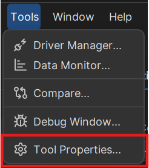
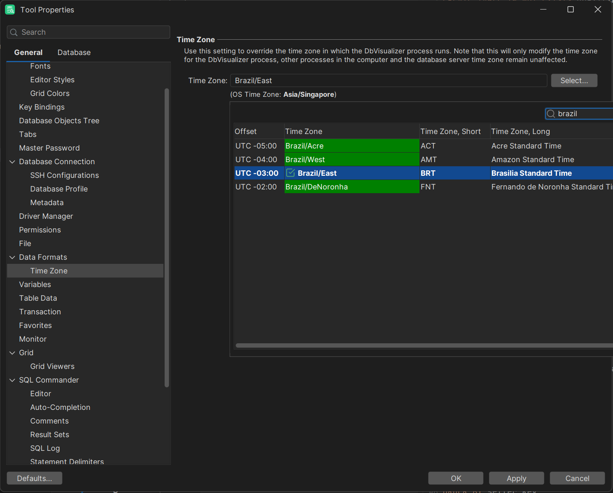
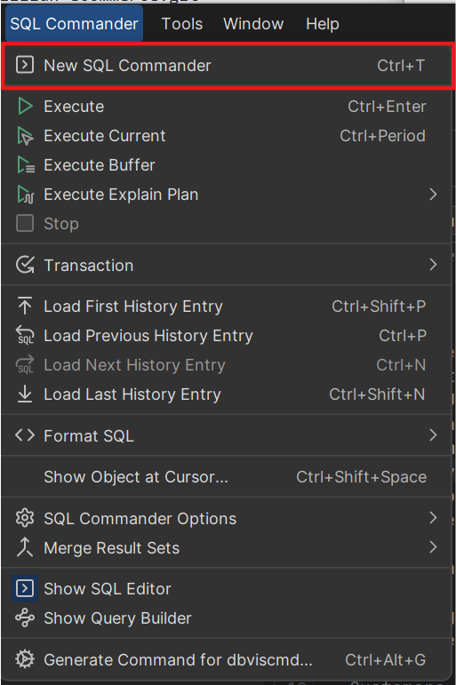
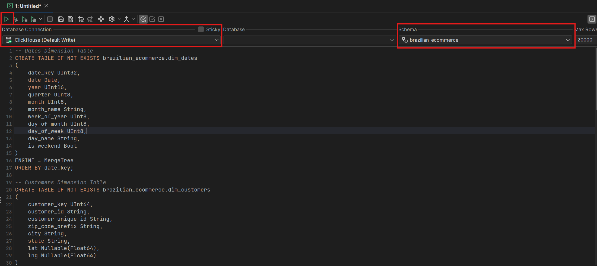
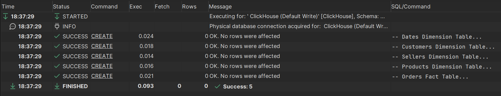
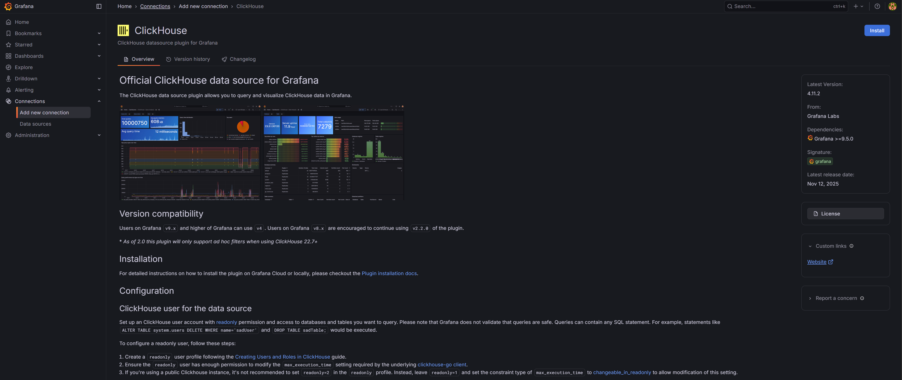

# Data Analysis Project on Brazilian E-Commerce Dataset

## Project Overview

## 🐍 Python Environment Setup

```bash
git clone https://github.com/zzhenjie01/brazilian-ecommerce.git
```

```bash
uv sync
```

## 🐳 Docker Setup

- [ClickHouse Network Ports](https://clickhouse.com/docs/guides/sre/network-ports)
- [ClickHouse Official Image](https://hub.docker.com/_/clickhouse)

Make sure Docker Desktop is running in the background. Then `cd` into `docker/` folder.

```bash
cd docker
```

Then, run the following command to start the ClickHouse and Grafana Docker containers.

```bash
docker-compose --project-name brazilian-ecommerce up -d
```

**Useful Docker commands:**

```bash
docker-compose stop           # Stop
docker-compose down           # Stop and remove
docker-compose logs -f        # View logs
docker-compose restart        # Restart
```

We can then use tools like DbVisualizer to connect to the Dockerized ClickHouse container at `http://localhost:8132`.

Default Credentials:

- Username: `default_write`
- Password: `default_write`

Be sure to set the display timezone to UTC-3 Brazil Standard Time to prevent confusion. In DbVisualzier it is "Tools" > "Tool Properties".




## ⭐ Create Tables

We can run `src/clickhouse_ddl.sql` in DbVisualizer connected to ClickHouse to create the fact and dimension tables definitions.





## 💽 Data Ingestion

To insert the fact and dimension tables into ClickHouse, run the Python script `src/clickhouse_insert.py`. In general, it is better to run python script as it allows automation.

Go to the project root directory and run the following

```bash
python src/clickhouse_insert.py
```

Using the following commands to insert will result in error because the parquet files lives locally. When the clickhouse client in the Docker container tries to find the file on its own file system, it won't be able to find it.

```bash
docker exec -i clickhouse clickhouse-client --query="INSERT INTO brazilian_ecommerce.fact_order_items FORMAT Parquet" < data/model/fact_order_items.parquet
```

## 🧰 Enable Access Management

First, we need to enable access management for the default user to create an admin account.

1. **Copy configuration files from container**

    This will copy the user configuration files of ClickHouse to local directory for editing.

    ```bash
    docker cp clickhouse:/etc/clickhouse-server/users.xml .
    docker cp clickhouse:/etc/clickhouse-server/users.d .
    ```

2. **Edit the default user configuration**

    Open `users.d/default-user.xml` and add these lines to enable access management features. This is to temporarily give the default user permission to create other users so that we can later create an administrator account with full administrative rights. [Official Docs](https://clickhouse.com/docs/operations/access-rights#enabling-access-control)

    ```xml
    <access_management>1</access_management>
    <named_collection_control>1</named_collection_control>
    <show_named_collections>1</show_named_collections>
    <show_named_collections_secrets>1</show_named_collections_secrets>
    ```

    > We only modify the `user.d/default-user.xml` file instead of `users.xml` because the settings in `users.xml` has been overriden by `user.d/default-user.xml` due to us specifiying `CLICKHOUSE_USER` and `CLICKHOUSE_PASSWORD` environment variables in our docker-compose file.

3. **Copy the modified file back**

    Save and then copy the `user.d/default-user.xml` file back to ClickHouse container.

    ```bash
    docker cp users.d/default-user.xml clickhouse:/etc/clickhouse-server/users.d/default-user.xml
    ```

4. **Restart ClickHouse to apply changes**

    Wait a few moments for the container to restart.

    ```bash
    docker restart clickhouse
    ```

## 🔐 Create Admin User

1. **Access ClickHouse container**

    ```bash
    docker exec -it clickhouse bash
    ```

2. **Login with default credentials**

    ```bash
    clickhouse-client --user default_write --password default_write
    ```

3. **Create admin user**

    ```sql
    CREATE USER admin_user IDENTIFIED BY 'admin_user';
    ```

4. **Grant admin with full administrative rights**

    ```sql
    GRANT ALL ON *.* TO admin_user WITH GRANT OPTION;
    ```

5. **Exit clickhouse-client and Docker container**

    ```bash
    exit # exit clickhouse-client
    exit # exit container
    ```

## 🚫 Restrict Default User

After creating the admin user, we don't want our default user to be able to create users. Only the admin user can create user.

1. **Edit the default user configuration**

    Modify the `user.d/default-user.xml` file in our local directory back to the original one.

    ```xml
    <!-- Currently look like this -->
    <access_management>1</access_management>
    <named_collection_control>1</named_collection_control>
    <show_named_collections>1</show_named_collections>
    <show_named_collections_secrets>1</show_named_collections_secrets>

    <!-- Change to this -->
    <access_management>0</access_management>
    ```

2. **Copy the modified file back**

    Save and then copy the `user.d/default-user.xml` file back to ClickHouse container.

    ```bash
    docker cp users.d/default-user.xml clickhouse:/etc/clickhouse-server/users.d/default-user.xml
    ```

3. **Restart ClickHouse to apply changes**

    Wait a few moments for the container to restart.

    ```bash
    docker restart clickhouse
    ```

## 📖 Create Read-only User

1. **Enter Clickhouse Docker container**

    ```bash
    docker exec -it clickhouse bash
    ```

2. **Login with admin credentials**

    ```bash
    clickhouse-client --user admin_user --password admin_user
    ```

3. **Create a read-only settings profile**

    Create a read-only profile with a default maximum execution time of 60 seconds. According to the [Official Grafana Docs](https://grafana.com/grafana/plugins/grafana-clickhouse-datasource/), we need to ensure that the read-only user have sufficient permissions to modify the `max_execution_time` setting required by the underlying clickhouse-go client.

    Alternative is to set `readonly = 2`. Then we don't have to set the `max_execution_time CHANGEABLE_IN_READONLY`.

    ```sql
    CREATE SETTINGS PROFILE readonly_profile SETTINGS readonly = 1, max_execution_time = 60;
    ```

    ```sql
    ALTER SETTINGS PROFILE readonly_profile MODIFY SETTINGS max_execution_time CHANGEABLE_IN_READONLY;
    ```

4. **Create read-only user**

    ```sql
    CREATE USER readonly_user IDENTIFIED BY 'readonly_user';
    -- If you want the password to be hashed
    -- CREATE USER readonly_user IDENTIFIED WITH sha256_password BY 'readonly_user';
    ```

5. **Assign profile to read-only user**

    ```sql
    ALTER USER readonly_user SETTINGS PROFILE readonly_profile;
    ```

6. **Grant Permissions**

    Grant `SELECT` privileges on the brazilian ecommerce database to the read-only user because by default, a new user has no access to any databases or tables. Must explicitly grant `SELECT` privileges to specific databases or tables.

    ```sql
    GRANT SELECT ON brazilian_ecommerce.* TO readonly_user;
    ```

7. **Exit and clean up**

    Exit the Clickhouse container

    ```bash
    exit # exit clickhouse-client
    exit # exit container
    ```

    Once done we can delete the `users.xml` and `users.d/default-user.xml` files from our local project directory.

## Grafana

Once the container for Grafana is setup, we can access it at `http://localhost:3000`

We can login with the following [default credentials](https://grafana.com/docs/grafana/latest/setup-grafana/sign-in-to-grafana/)

Credentials for first time login

- Username: `admin`
- Password: `admin`

If we are logging in for first time, we will be prompted to change the password. For simplicity for this project, we can just change it to `admin123`.

Update credentials

- Username: `admin`
- Password: `admin123`

Once logged in, we should install the plugin for ClickHouse. Go to "Connections" > "Add new connection". Then find ClickHouse and install it.



## 🔌 Ports Used

- Grafana: `3000`
- ClickHouse HTTP: `8123`
- ClickHouse Client: `9000`

## 👤 Account Credentials Reference

**ClickHouse:**

| User      | Username        | Password            | Purpose                        |
| --------- | --------------- | ------------------- | ------------------------------ |
| Admin     | `admin_user`    | `admin_user`        | Full database administration   |
| Read-only | `readonly_user` | `readonly_user`     | Grafana dashboards & reporting |
| Default   | `default_write` | `default_write`     | Writing Data to ClickHouse     |
