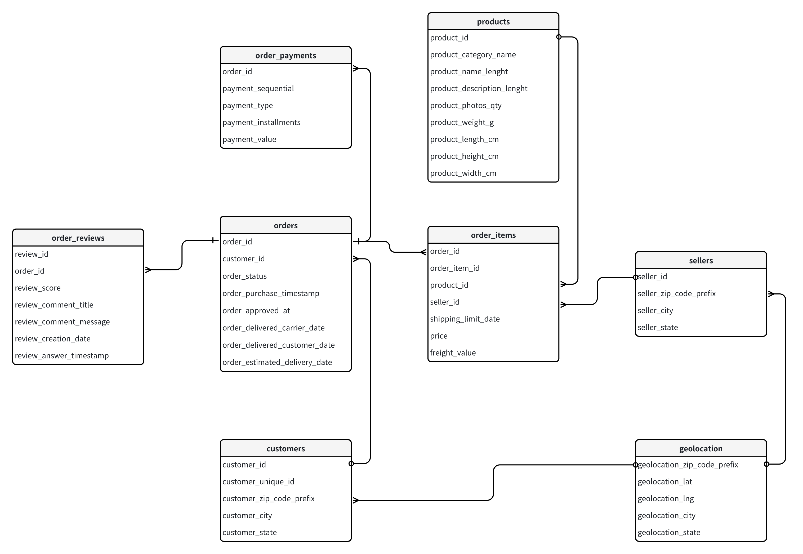
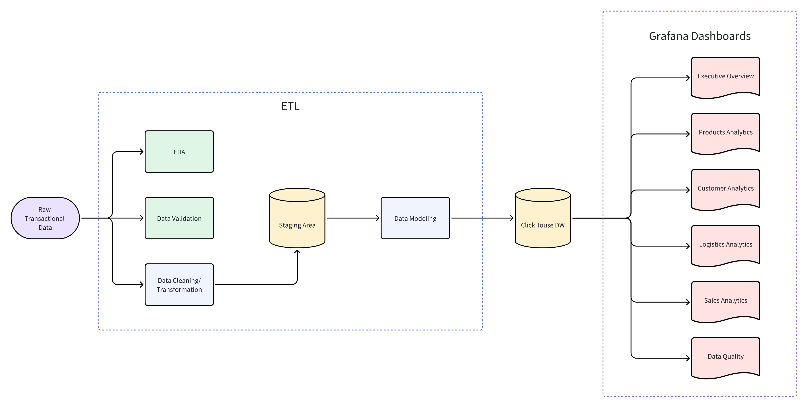
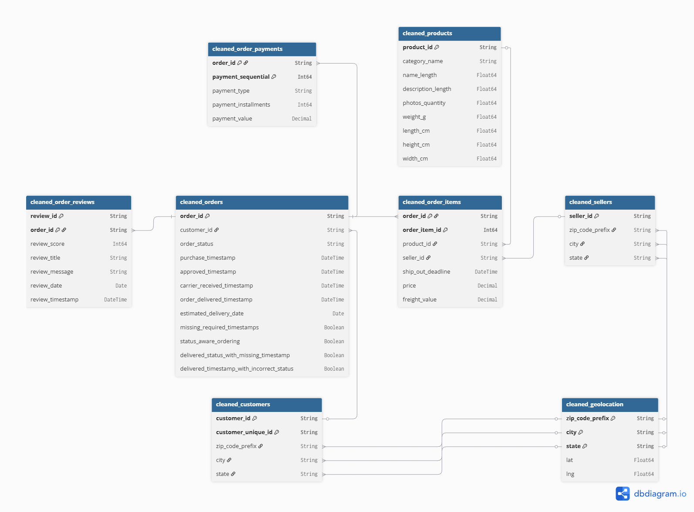
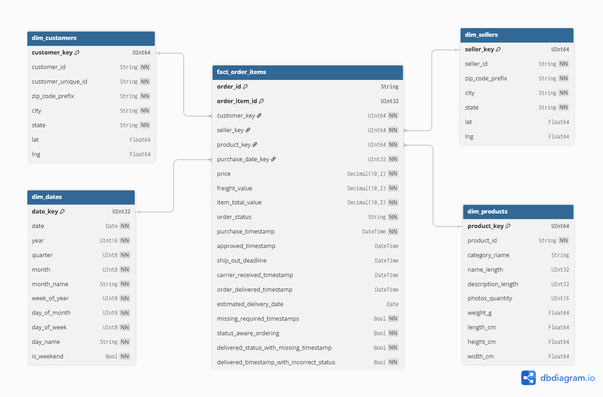
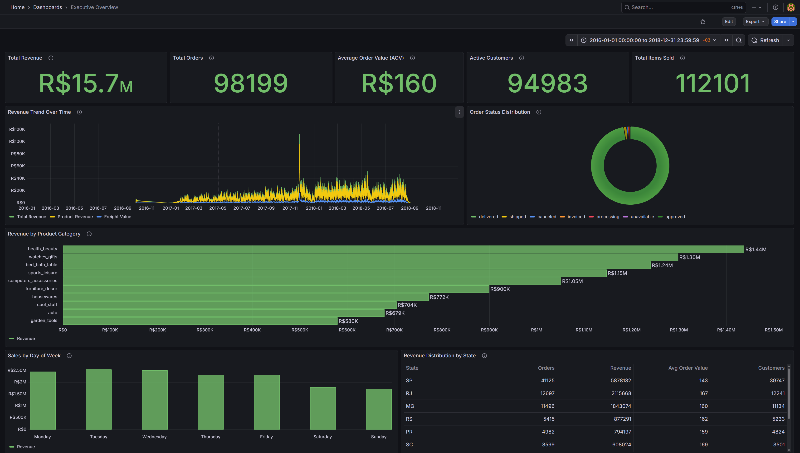
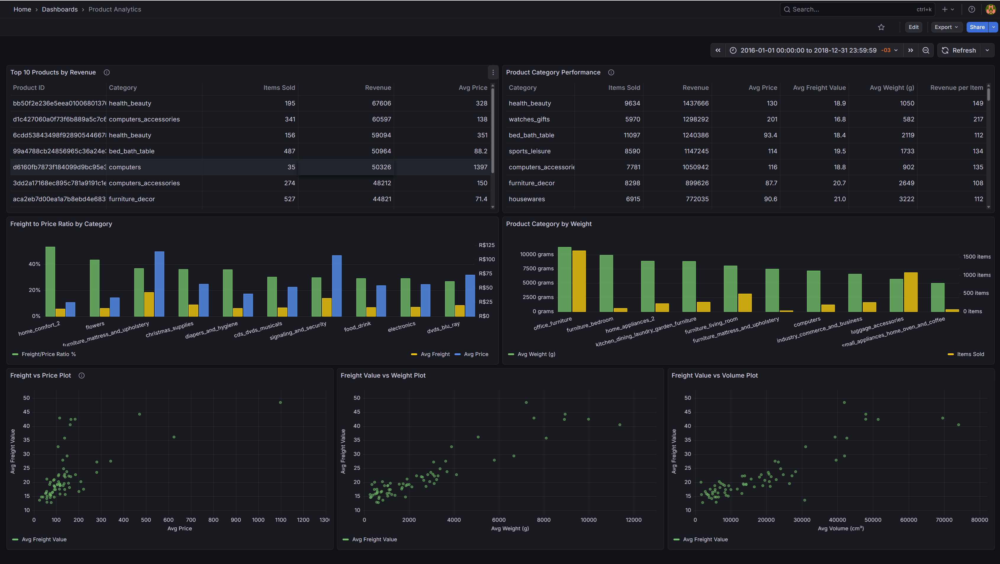
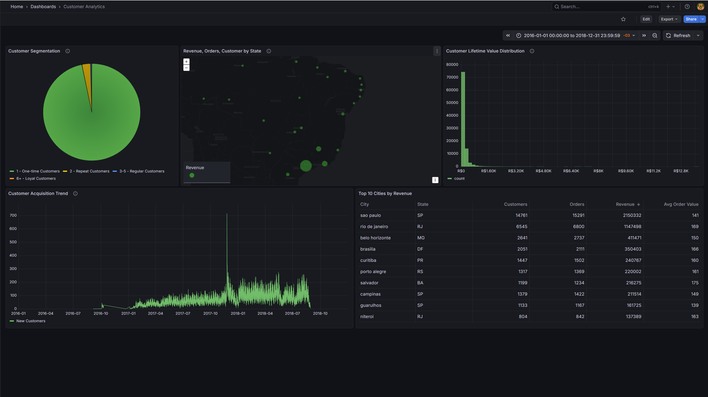
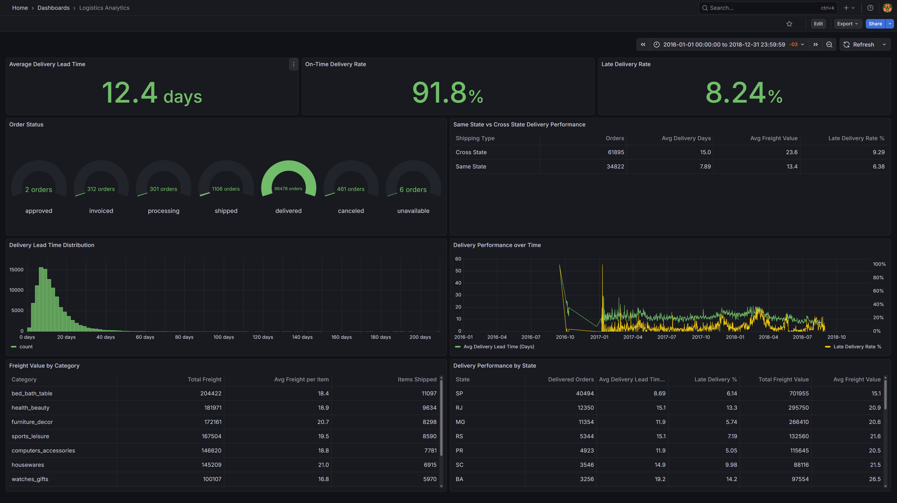
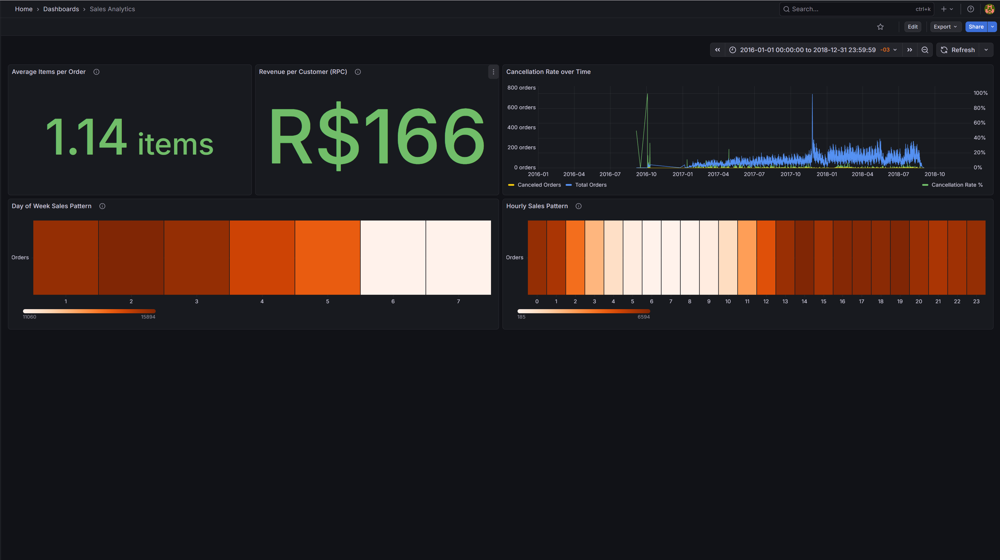
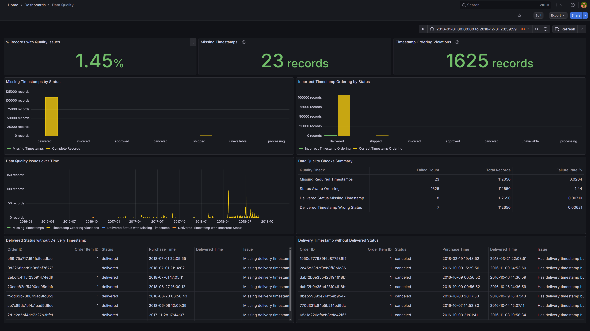

# Data Analysis Project on Brazilian E-Commerce Dataset

## 🛠️ Technologies Used

| Component | Technology | Purpose |
| ----------- | ----------- | --------- |
| Data Processing | Python (Pandas) | EDA, cleaning, transformation |
| Data Warehouse | ClickHouse | OLAP storage and query engine |
| Visualization | Grafana | Interactive dashboards |
| Development | Docker | Local deployment of ClickHouse/Grafana |
| Data Format | Parquet | Type-safe intermediate storage |
| Database Client | DbVisualizer | ClickHouse schema management |

## 🎯 Objective

**Overall Objective:** To simulate data analyst end-to-end workflow in the context of ecommerce setting using Brazilian E-commerce dataset.

**Learning Objectives:**

- EDA
- Data Cleaning & Tranformation
- Data Quality Engineering
- Data Modelling
- Data Layering (Staging Area, Data Warehouse)
- Dashboard Development
- Data Visualization

## 📈 Dataset

The dataset used in this project is the Brazilian E-commerce Dataset by Olist on [Kaggle](https://www.kaggle.com/datasets/olistbr/brazilian-ecommerce/data). The dataset has information of 100k orders from 2016 to 2018 made at multiple marketplaces in Brazil.

### Dataset Context

This dataset is provided by Olist, the largest department store in Brazilian marketplaces. Olist connects small businesses from all over Brazil to channels without hassle and with a single contract. Those merchants are able to sell their products through the Olist Store and ship them directly to the customers using Olist logistics partners.

After a customer purchases the product from Olist Store a seller gets notified to fulfill that order. Once the customer receives the product, or the estimated delivery date is due, the customer gets a satisfaction survey by email where he can give a note for the purchase experience and write down some comments.

## 💾 Raw Dataset Schema




## 🌊 Project Flow



1. Perform EDA on the raw transactional ecommerce data (basic checks)
2. Perform Data Validation (business checks and referential integrity)
3. Perform Data Cleaning (dropping duplicate rows, standardizing timestamp to UTC, standardizing accented characters to English characters, boolean flags to mark rows that violate business logic)
4. Data is modeled into star schema (fact and dimension tables) for Data Warehousing in ClickHouse
5. Grafana is connected to ClickHouse DW for dashboarding and visualization

## 🔍 1 Exploratory Data Analysis (EDA)

Checks the following:

- Table shape/dimensions
- Duplicated rows
- Missing/null values
- Column data types
- Descriptive statistics (min, max values)
- Numeric columns >= 0 (based on business logic)
- Categorical column values
- Date/timestamp column ranges
- Column naming conventions

### 1.1`orders` table

- The dates and timestamp columns are all read in by Pandas as string as indicated by the `object` data type. This means that if we want to do comparison or manipulation of time, we should **cast it to Pandas datetime**.
- There are also missing values in `order_approved_at`, `order_delivered_carrier_date`, and `order_delivered_customer_date` columns which is not surprising given that there might be orders that are not delivered to logistics partner or to customer at the point of creation of this dataset.
- Note that the `order_delivered_carrier_date` is the timestamp where the order/parcel reaches the logistics partner.
- The **column names are not consistent in naming** where some timestamp columns are called date.
- Notice, how the columns that are actual dates (e.g. `order_estimated_delivery_date`) has `00:00:00` as the time in the timestamp.

**Typical Lifecycle of Ecommerce Order:**

```text
created -> approved -> invoiced -> processing -> shipped -> delivered
```

**Order Status Column:**

- created: The order has been placed but not yet processed.
- approved: Payment for the order has been approved.
- invoiced: An invoice has been generated for the order.
- processing: The order is being prepared for shipment, after payment approval.
- shipped: The order has been handed over to the shipping carrier.
- delivered: The order has successfully reached the customer.
- canceled: The order was terminated by the customer or seller.
- unavailable: The product became unavailable, preventing sale completion.

### 1.2 `order_reviews` table

- There are reviews with missing titles and review messages. This is acceptable because some buyers only want to rate.
- The review ratings ranges from 1 to 5 inclusive, which is a typical range for rating of products in ecommerce.
- The review ratings are mainly clustered around 1, 4, 5 which makes sense since most customers either like a particular product very much or hate it very much, perhaps due to it not working as intended or defects.
- There are timestamp and date columns which means that in our ETL, we need to **cast them to datetime** since they are currently interpreted as string by Pandas.

### 1.3 `order_payments` table

- There are more rows in `order_payments` table compared to `orders` table. The reason for this is because a single order can be paid over multiple installments.
- The numeric columns are all greater than 0 which means the data is valid.
- The `payment_sequential` tells us which installment is the current payment making and the `payment_installments` is the total number of installments for a particular order.
- Customers who pay off the order in one shot will have `payment_sequential = 1` and `payment_installments = 0` which is the minimum value for both columns.
- `max(payment_sequential)` > `max(payment_installments)` which means that there are customers who did not manage to pay finish by the end of the last installment, leading them to take more installments.
- `min(payment_value)` = 0 and this could be due to the product in the order being a free gift or the customer use some voucher to offset the payment value.
- There are 3 orders whose payment type is not defined. One possible reason could be a new payment method that is not in the list of payment (software/backend bug). We would not drop this during ETL as it would lead to wrong sales and payment figures.
- In this table, we have columns that deals with money, thus we need their data type to be precise `float64` is unsuitable. We need it to be `Decimal`.

### 1.4 `order_items` table

- The `shipping_limit_date` here is just a deadline for sellers to hand over an order to the logistics partner. This can be **compared** with `order_delivered_carrier_date` in the `orders` table to **track if sellers meet their fulfillment obligations**.

### 1.5 `products` table

- `product_name_lenght` and `product_description_lenght` columns have typo in their column name and needs to be **renamed**.
- There are products without category names, descriptions and physical measurements. These depends on whether the ecommerce platform wishes to enforce them to be compulsory when the sellers list their products.
- The product category names are also in Portuguese which means we have to **map it to English** using the `product_category_name_translation.csv` later.

### 1.6 `sellers` table

- The `seller_zip_code_prefix` has some values which are 4 digits and some 5 digits. This happens because the state of São Paulo, for instance, uses prefixes starting with `0` (e.g., `01001`). If we read `01001` as a number, the leading zero is dropped, and it becomes `1001` (4 digits). This is further confirmed when we check the data type for the column is integer. So, when **reading zip code columns, need interpret it as a string**.

### 1.7 `customers` table

- It has two id columns: `customer_id` and `customer_unique_id`.
- `customer_id` is the **primary key** for this table not `customer_unique_id`
- `customer_id` is "the event" which linked to a specific order in the `orders` table. Think of it as the transaction token or session id for a specific purchase.
- `customer_unique_id` is "the account" that represents the actual person or human.
- If you made 3 separate purchases, you would have 3 duplicate `customer_unique_id` but 3 distinct `customer_id`
- Why structure it this way? This is to address the scenario where you use the same account to order but sent the order to two different address. If we only have one row for the customer (the human), updating address for Order 2 might accidentally change the record for Order 1. Thus, use `customer_id` (with its own address data) for every single order, and use `customer_unique_id` to trace them back to the same account.

### 1.8 `geolocation` table

- The table has 261,831 duplicated rows. This means that we need to **remove duplicates** in our ETL later.
- We are told that a particular zip code prefix should correspond to a city within a state. There may be many records for a particular prefix. This is because:
  - Spelling variations in city names such as `sao paulo`, `são paulo`, `saopaulo`, and `s. paulo` all refers to the same city. but will appear as 4 different records. Thus, we need to **standardize the spelling of city names**.
  - Even if the name is standardized, there might be multiple latitude and longitudes for a single city as the cities cover a wide area instead of being a single precise points on a map. Thus, we can take the mean of latitude and longitude to get a centroid coordinates for the city.

## ✅ 2 Data Validation

Checks the following:

- Uniqueness of keys
- Business logic
- Inconsistencies of city names convention
- Time zone of timestamps
- Referential integrity

### 2.1 `orders` table

- `order_id` is the primary key for this table

There are 4 business checks that needs to be done for this table:

**The following table shows which timestamps must be present (✅) or may be absent (❌) based on the order_status:**

| order_status | purchase | approved | carrier | delivered |
| ------------ | -------- | -------- | ------- | --------- |
| created      | ✅       | ❌       | ❌      | ❌        |
| approved     | ✅       | ✅       | ❌      | ❌        |
| invoiced     | ✅       | ✅       | ❌      | ❌        |
| processing   | ✅       | ✅       | ❌      | ❌        |
| shipped      | ✅       | ✅       | ✅      | ❌        |
| delivered    | ✅       | ✅       | ✅      | ✅        |
| canceled     | ✅       | ❌/✅    | ❌      | ❌        |
| unavailable  | ✅       | ❌/✅    | ❌      | ❌        |

**Expected chronological ordering of timestamps:**

```text
order_purchase_timestamp
≤ order_approved_at
≤ order_delivered_carrier_date
≤ order_delivered_customer_date
```

**Business Rule Violations Found:**

1. **Missing required timestamps based on order_status** (22 violations)
    - For example, `order_status = 'shipped'` but `order_delivered_carrier_date` is null.
    - **Root cause**: In distributed systems, the 'Status' of an order and the 'Timestamp' of an event are often updated by different triggers. An order status might flip to 'shipped' based on a warehouse worker scanning a barcode (an internal event), but the `order_delivered_carrier_date` might depend on an API callback from the logistics partner (an external event). If the API call fails or times out, the status remains 'shipped' but the timestamp never arrives.

2. **Timestamp chronological ordering violations based on order_status** (1,405 violations)
    - For example, `order_delivered_customer_date` < `order_approved_at`.
    - **Root causes**:
      - **Asynchronicity**: The payment system might approve an order instantly, but due to a queue lag, the 'approved' timestamp is written to the database hours later, potentially after the warehouse has already packed and shipped it to the logistics partner.
      - **Human-in-the-Loop**: A customer service agent might manually force an order to 'Delivered' status to resolve a complaint, bypassing the logical checks and potentially inserting a timestamp that predates the approval to 'fix' a record.

3. **Orders marked as 'delivered' without delivery timestamp** (8 violations)
    - **Root cause**: The system might have a rule that auto-closes orders as 'delivered' after 30 days if no complaint is filed, even if the carrier integration never sent a final timestamp.

4. **Orders with delivery timestamp but status not marked as 'delivered'** (6 violations)
    - **Root cause**: The system received the 'Delivered' event (hence the timestamp exists), but the database transaction that updates the `status` column failed or was rolled back.

**How to handle these violations:**

| Issue                                    | Drop? | Use for revenue? | Use for SLA? |
| ---------------------------------------- | ----- | ---------------- | ------------ |
| Missing delivery timestamp but delivered | ❌    | ✅               | ❌           |
| Shipped but has delivered timestamp      | ❌    | ✅               | ❌           |
| Timestamp ordering violation             | ❌    | ✅               | ❌           |
| Order Status canceled / unavailable      | ❌    | ❌               | ❌           |

#### Solution/Fix

- We should not blindly drop these records as they still contribute to revenue figures and affects customer counts too.
- Since they are date/timestamp columns, we can not impute it with values such as 0 or mean or median. We cannot interpolate as well.
- We can safely leave these invalid records as it is and missing values as NULL because when we use SQL aggregate functions such as `COUNT()` or `AVG()` in Data Warehouse, NULLs would be excluded from computation.
- However, for certain metrics such as delivery SLA or KPI, having Rule 3 & 4 violated may not be acceptable and thus should be excluded from calculation.
- **For each of the 4 rules, we add a flag column in the table that indicates if the rule is violated.**
- For Rules 3 and 4, we can **combine them into a single column** since if either 3 or 4 is violated, we cannot use it for delivery KPI metrics.

### 2.2 `order_reviews` table

- `review_id` and `order_id` and their own are not unique. However, `(review_id, order_id)` composite key is unique.
- `review_id` is not unique because it is possible for a review to be applied to multiple orders. The ecommerce platform will send a "Please review your purchase" email, which will allow the user to write one single comment that applies to all those orders.
- `order_id` is not unique because a customer might review an order but then change their mind a few weeks later, thus updating the review for the order which generates a new record.
- Depending on business requirements and how we want to model the data for the Data Warehouse, we can **choose to keep the latest review or the average review score**

### 2.3 `order_payments` table

- `order_id` is not unique because a particular order can be broken down into multiple installments
- Thus, `(order_id, payment_sequential)` composite key is unique.

### 2.4 `order_items` table

- `order_id` is not unique because a particular order can have multiple items from the same shop or different shop.
- `(order_id, order_item_id)` is unique because `order_item_id` is a secondary key within a particular order that tells us which product from which seller.

### 2.5 `products` table

- `product_id` is the unique identifier for this table

### 2.6 `sellers` table

- `seller_id` is the unique identifier for this table

### 2.7 `customers` table

- `customer_id` is the unique identifier for this table. Not `customer_unique_id`.
- The reason is explained in the previous section.

### 2.8 `geolocation` table

- There are inconsistencies in the naming of the same city for example, `sao paulo` and `são paulo` refers to the same city.
- We should **group by the zip code prefix and take the mean of the latitude and longitude**.

### 2.9 Check Timezone

All timestamps in the dataset lack timezone information. The data source documentation doesn't specify whether timestamps are in UTC or Brazilian Standard Time (BRT, UTC-3). To determine this, we analyzed the distribution of order purchase timestamps.

We created two distribution plots:

- **Plot 1**: Assumes timestamps are already in Brazilian local time (UTC-3), no adjustment needed
- **Plot 2**: Assumes timestamps are in UTC, adjusted by -3 hours to convert to local time

**Finding**: The distribution reveals that **timestamps are in local Brazilian time (UTC-3)**. The lowest order volume occurs between 4-5 AM, which aligns with typical e-commerce patterns when most customers are asleep. This would not be the case if timestamps were in UTC.

**Note**: Midnight is not the lowest point despite being late at night because many customers are still awake, and platforms often run midnight flash sales.

#### Daylight Savings Time (DST)

- Interestingly, before 2019, Brazil observe Daylight Saving Time (DST) in the months of the year (Oct - Feb) where timing will shift by an hour. Time changes were almost always done at midnight. The time was advanced from 00:00 to 01:00 on the DST starting date and reduced from 00:00 on the ending date to 23:00 of the previous day.
- Our dataset is from 2016 - 2018 which means the timestamps might observe DST. However, when we try to localize the timestamps to `"America/Sao_Paulo"`, we got the following error.

```text
AmbiguousTimeError: Cannot infer dst time from 2018-02-17 23:50:41, try using the 'ambiguous' argument
```

- On certain dates (usually in February), the clock would **move backward by one hour**, so some local times (e.g. `2018-02-17 23:50:41`) actually occurred **twice** (once in DST and once in standard time).
- When pandas calls `.tz_localize("America/Sao_Paulo")`, it encounters these duplicated hours and thus raises the error.
- We can see how DST introduces additional complexity and for the purpose of this project, we will assume that DST is not observed and only consider whether the timestamps are UTC or UTC-3.

### 2.10 Check Referential Integrity

- All tables passed referential integrity checks except the `sellers` and `customers` tables.
- 7 sellers with zip code prefixes that do not exist in the `geolocation` table.
- 278 customers with zip code prefixes that do not exist in the `geolocation` table.
- **Possible reasons**:
  - Customers may have saved an invalid address zip code when adding a delivery address to their account.
  - New residential areas in Brazil get assigned new zip codes but the `geolocation` table is an outdated snapshot.
- We will not remove these customers or sellers as other tables reference them. Instead, when joining the `geolocation` table to them, the latitudes and longitudes will be NULL.

## 🧹 3 Data Transformation (Cleaning)

Performs the following:

- Dropping duplicate rows
- Conversion of timestamps into UTC
- Conversion of date columns into date
- Create Boolean flag columns to indicate rows that violate business logic
- Renamed column names for clarity
- Standardized accented city names into standard English names

After transformation is done, each of the tables are saved to local staging area (`REPO_ROOT/data/staging`) and the format is `.parquet`. Parquet rather than CSV is used to ensure that data types are preserved when saving a table.

### 3.1 `orders` table

- Convert timestamp columns from strings into datetime -> interpret it as UTC-3 -> convert to UTC. This is done because after data modelling, we are going to ingest the data into Data Warehouse whose standard practice is to store timestamps as UTC to avoid confusion or ambiguity. Thus, we need to convert.
- Convert date columns from string timestamp into date object
- Created 4 Boolean flag columns to handle timestamps that failed business checks
  - `missing_required_timestamps`: based on `order_status` column, certain timestamps are missing.
  - `status_aware_ordering`: based on `order_status` column, the different timestamp columns should respect the chronological order of an ecommerce order lifecycle.
  - `delivered_status_with_missing_timestamp`: orders where it is marked as delivered but does not have a delivered timestamp
  - `delivered_timestamp_with_incorrect_status`: orders where there is delivery timestamp but order status is not marked as delivered.
- Renamed the column names for clarity. For example `order_delivered_carrier_date` is the timestamp where the parcel is received at the logistics partner so we renamed it to `carrier_recieved_timestamp`

### 3.2 `order_reviews` table

- Convert timestamp columns from strings into datetime -> interpret it as UTC-3 -> convert to UTC
- Convert date columns from string timestamp into date object

### 3.3 `order_payments` table

- Nothing to change or modify

### 3.4 `order_items` table

- Convert timestamp columns from strings into datetime -> interpret it as UTC-3 -> convert to UTC
- Rename `shipping_limit_date` column to `ship_out_deadline` because it is the timestamp deadline that a particular order item needs to be shipped out i.e. handed over and received by the logistics partner.

### 3.5 `products` table

- Columns are renamed for clarity. Specifically the prefix "products" in the column names are removed because we know all these attributes belong only to the `products` table. There is no ambiguity.

### 3.6 `sellers` table

- Seller's zip code prefix is converted to string and then padded with 0's from the left to make it 5 digits.
- Accented characters in city name are replaced with standard English alphabets.
- Columns are renamed for clarity.

### 3.7 `customers` table

- Customer's zip code prefix is converted to string and then padded with 0's from the left to make it 5 digits.
- Accented characters in city name are replaced with standard English alphabets.
- Columns are renamed for clarity.

### 3.8 `geolocation` table

- Row duplicates are dropped
- Zip code prefix is converted to string and then padded with 0's from the left to make it 5 digits.
- Accented characters in city name are replaced with standard English alphabets.
- Group by `("geolocation_zip_code_prefix", "geolocation_city", "geolocation_state")` and the the mean for both latitude and longitude.

### 3.9 Cleaned Tables Schema



**Note:**

- `name_length`, `description_length`, `photos_quantity` are in `float64` because they contain NULL values. So pandas auto-upcasts to `float64` so that can mark it using NaNs. Thus, we need to cast them to appropriate integer types before ingesting into ClickHouse.

## 🤖 4 Data Modeling

This section aims to do data modeling on the clean data. Specifically, we will be doing dimensional modeling to model the data into star schema. Star schema consist of a central fact table surrounded by a few dimension tables. The fact table contains events and measures (e.g. price, freight_value) and the dimension tables contain context (e.g. product name, product dimensions). They are often related to each other by surrogate keys rather than the business natural keys.

- Fact table stores foreign keys that references dimension tables.
- Dimension tables carry descriptive attributes.

**Why star schema?**

- Star schema means that the central fact table is at most one join away from the dimension tables. This means we don't use excessive joins which improves analytical performance.
- Snowflake schema is an extension of star schema by normalizing some dimension tables. This reduces data redundancy at the cost of analytical performance.

**Why Surrogate Keys?**

- Decouple warehouse from source system IDs (business natural keys)
- Smaller integers → faster joins
- Enables future SCD Type-2 if needed

We will:

- Add **integer surrogate keys** to each dimension
- Keep **natural keys** as attributes
- Store **surrogate keys in fact tables**

### 4.1 Start with the Business Question

To start off, we start with the business question and ask ourselves what business question we want to answer? Some of the potential question we want to answer are:

- Revenue by day / month / quarter
- Revenue by product / category
- Revenue by seller / region
- Delivery performance (lead time, delays)

### 4.2 Fact table choice & granularity

Fact table is going to be built from `cleaned_order_items` because its granularity is one product in one order. Grain is what one row in the fact table represents. This is the lowest stable grain.

However, we need to create dimension tables first as the fact table would be referencing them.

### 4.3 Dimension Tables

We will create 4 dimension tables.

#### `dim_dates`

- Formed by compiling various timestamps and dates columns from various cleaned tables into one table
- Remove duplicates and then convert them into dates.
- Thereafter, various date related information such as day of month and quarter are derived.
- The grain is one row per calendar date.
- No null values

#### `dim_customers`

- Formed from joining `cleaned_geolocation` to `cleaned_customers`.
- This is done so that the table now has latitude and longitude information and we can do geospatial analysis if need be.
- The `cleaned_geolocation` table's primary key is actually `("zip_code_prefix", "city", "state")`. Not `"zip_code_prefix"`, we previously thought. Thus, when joining, we need to join on these three columns.
- The grain is one customer's transaction profile per row because one customer account can have many delivery address
- Null values:
  - `lat`: 302
  - `lng`: 302

#### `dim_seller`

- Formed from joining `cleaned_geolocation` to `cleaned_sellers`.
- This is done so that the table now has latitude and longitude information and we can do geospatial analysis if need be.
- Due to similar reason as `dim_customers`, we join on `("zip_code_prefix", "city", "state")`.
- The grain is one seller per row.
- Null values:
  - `lat`: 135
  - `lng`: 135

#### `dim_products`

- Not much transformation done except for creation of surrogate key, reordering columns and casting columns to appropriate data types.
- The grain is one product per row.
- Null values:
  - `name_length`: 610
  - `description_length`: 610
  - `photos_quantity`: 610
  - `weight_g`: 2
  - `length_cm`: 2
  - `height_cm`: 2
  - `width_cm`: 2

**Why need a date dimension?**

It allows for:

- QoQ growth
- Weekday vs weekend analysis
- Monthly seasonality

Putting it as a date dimension table also ensure that if we need to calculate metrics like QoQ growth, we don't need to write complex SQL queries and date functions to partition the dates into quarters.  All the information is already "precomputed", making analytics faster. If we have many queries that requires quarter information, it becomes tedious to keep calculating which purchase timestamp belong to which quarter.

**How is Slowly Changing Dimensions (SCD) handled?**

- This dataset is a static historical snapshot with no evidence of attribute evolution over time.
- So we implemented Type 1 dimensions i.e. any updates will overwrite existing records in dimension tables.
- However, in production systems, customer and seller information could very well change over time. Thus, we would need to implement Type 2 dimensions where we have columns like `effective_start`, `effective_end`, `is_effective` to track historical records and current records.

### 4.4 Fact Table

#### `fact_order_items`

- Our fact table `fact_order_items` is obtained by joining `cleaned_orders` to `cleaned_order_items`.
- This gives the `cleaned_order_items` table information about the various timestamps such as purchase timestamps, delivery timestamps etc.
- We converted the timestamp into seconds precision to match ClickHouse because Pandas store timestamps in nanoseconds precision while ClickHouse `DateTime` type is in seconds precision.
- To relate this fact table to `dim_dates` table, we only picked `"purchase_timestamp"` because other timestamp columns have NULL values.
- We also created a new measure column `"item_total_value"` which is the addition of price and freight value for each item. This is to ensure easier computation of metrics.
- Null values:
  - `approved_timestamp`: 15
  - `carrier_received_timestamp`: 1194
  - `order_delivered_timestamp`: 2454

**What about `cleaned_order_reviews` and `cleaned_order_payments` tables?**

- They are not used in this case as they are different grain from `cleaned_order_items`
- Each row in these tables are at the transaction/order level rather than item level

**Why only purchase date key?**

- The other timestamp columns have missing values due to order being not completely delivered while `purchase_timestamp` is always present.
- Thus, it does not make sense for us to reference the date dimension table and force a dimensional relationship.
- Also, for most sales KPI and analysis, it is defined with respect to purchase timestamp rather than delivery timestamp.
- Other timestamps are useful when trying to optimize the logistic side of things. However, for these scenarios, comparing timestamps would be more appropriate rather than dates because from order purchase to shipped out to logistics partner could be within the same day.
- Furthermore, the industry practice is to associate a single business event with an single event time to ensure the grain of the fact table is consistent.

**Why is there no estimated delivery date key?**

- We didn't create a date key column for `estimated_delivery_date` since it is just an estimation rather than a guarantee or business event that could be used to compute important sales KPIs.
- It is not guaranteed to be accurate or present and cannot be used to slice revenue by time.
- The only instance where this date would be useful is to determine whether an estimate is reasonable which does not need information like which quarter is this delivery estimated date from.

**Why not drop the timestamps in favor of the dates?**

- We did not drop the timestamps because the logistics department may need these information to do intra-day analysis or delivery SLA.
- However, they are not modeled into dimension tables because of the complexity. Timestamps have very fine granularity, up to seconds. There is also the issue of different time zones.
- Furthermore, given that ClickHouse is columnar data store, extra columns are cheap and queries only need scan the columns they need. So, there's no real downside to keeping them.

**Why not merge `delivered_status_with_missing_timestamp` and `delivered_timestamp_with_incorrect_status` into a single column?**

- They represent different failure modes.
- Combining them loses diagnostic power. We don't know what is the specific reason why we exclude a row from delivery KPI calculation.
- We can always derived it in SQL later.

### 4.5 Other things done

- Creating surrogate keys for the dimension tables using DataFrame's index + 1.
- We can do this because the `id` column in each of them is unique and not null and hence the rows are unique and not null.
- For `dim_dates` the surrogate key is the date in `YYYYMMDD` format but in integer type rather than string or datetime type.
- Adding these surrogate keys to the fact table and dropping the natural keys in the fact table.
- Reordering columns for clarity and also to group similar columns together, especially for fact table where there is a lot of columns.
- Casting the data types to match the ClickHouse schema data types. For example, `Decimal` for monetary value, `UInt64` for surrogate keys.
- Uniqueness of keys check
- Referential integrity check

**Why YYYYMMDD used as surrogate key in `dim_dates`?**

- We need a surrogate key for the other dimension tables because their natural key is a alphanumeric string whose format may change overtime causing unintentional duplicates.
- So we used incremental numbers to distinguish these records.
- Dates on the other hand is "fixed" in a sense that there is always a year, month, day.
- Even if they are in different order, they can always be arranged to YYYYMMDD format.
- So it is better to use it as a surrogate key since it clear and has a meaning instead of using a meaningless integer
- YYYYMMDD instead of DDMMYYYY format also ensures that the keys are inherently sequential and ordered chronologically.
- This ordering allows us to store the date key as an integer in terms of string.

**Why store date key as integer, specifically UInt32?**

- Storing as integer is more space efficient and result in faster joins compared to string.
- UInt32 was chosen as it is large enough to accommodate to all possible dates.
- The dates are bounded by 8 digits. So, we don't need a super large type like UInt64.
- The rest of the surrogate keys need UInt64 as they are incrementing integers and thus is unbounded.

### 4.6 Final Schema



- After we modeled into this star schema, we saved it as parquet files.
- We created a DDL file (`src/clickhouse_ddl.sql`) containing the table definitions and ran them in DbVisualizer connected to ClickHouse, to create these fact and dimension tables.
- Next, we inserted the records/data into these ClickHouse tables using a Python script (`src/clickhouse_insert.py`).

## 💽 5 ClickHouse

```sql
-- Dates Dimension Table
CREATE TABLE IF NOT EXISTS brazilian_ecommerce.dim_dates
(
    date_key UInt32,
    date Date,
    year UInt16,
    quarter UInt8,
    month UInt8,
    month_name String,
    week_of_year UInt8,
    day_of_month UInt8,
    day_of_week UInt8,
    day_name String,
    is_weekend Bool
)
ENGINE = MergeTree
ORDER BY date_key;

-- Customers Dimension Table
CREATE TABLE IF NOT EXISTS brazilian_ecommerce.dim_customers
(
    customer_key UInt64,
    customer_id String,
    customer_unique_id String,
    zip_code_prefix String,
    city String,
    state String,
    lat Nullable(Float64),
    lng Nullable(Float64)
)
ENGINE = MergeTree
ORDER BY customer_key;

-- Sellers Dimension Table
CREATE TABLE IF NOT EXISTS brazilian_ecommerce.dim_sellers
(
    seller_key UInt64,
    seller_id String,
    zip_code_prefix String,
    city String,
    state String,
    lat Nullable(Float64),
    lng Nullable(Float64)
)
ENGINE = MergeTree
ORDER BY seller_key;

-- Products Dimension Table
CREATE TABLE IF NOT EXISTS brazilian_ecommerce.dim_products
(
    product_key UInt64,
    product_id String,
    category_name Nullable(String),
    name_length Nullable(UInt32),
    description_length Nullable(UInt32),
    photos_quantity Nullable(UInt16),
    weight_g Nullable(Float64),
    length_cm Nullable(Float64),
    height_cm Nullable(Float64),
    width_cm Nullable(Float64)
)
ENGINE = MergeTree
ORDER BY product_key;

-- Orders Fact Table
CREATE TABLE IF NOT EXISTS brazilian_ecommerce.fact_order_items
(
    -- Grain (Degenerate dimension)
    order_id String,
    order_item_id UInt32,
  
    -- Surrogate keys
    customer_key UInt64,
    seller_key UInt64,
    product_key UInt64,
    purchase_date_key UInt32,
  
    -- Measures
    price Decimal(10, 2),
    freight_value Decimal(10, 2),
    item_total_value Decimal(10, 2),
  
    -- Core attributes
    order_status String,
    purchase_timestamp DateTime('UTC'),
    approved_timestamp Nullable(DateTime('UTC')),
    ship_out_deadline Nullable(DateTime('UTC')),
    carrier_received_timestamp Nullable(DateTime('UTC')),
    order_delivered_timestamp Nullable(DateTime('UTC')),
    estimated_delivery_date Nullable(Date),
  
    -- Data quality flags
    missing_required_timestamps Bool,
    status_aware_ordering Bool,
    delivered_status_with_missing_timestamp Bool,
    delivered_timestamp_with_incorrect_status Bool
)
ENGINE = MergeTree
PARTITION BY toYYYYMM(purchase_timestamp) -- partition by month for performance
ORDER BY (purchase_date_key, order_id, order_item_id);
```

### 5.1 Design Decisions

**How did we order the columns in fact table?**

- We ordered it based on logical group such as identity/grain, foreign keys, measures, business lifecycle timestamps, data quality flags.

**Does table column order matter?**

- For performance no, but for readability yes.
- ClickHouse is a _column-oriented_ database. Unlike row-oriented databases (like MySQL/Postgres) where row data is stored sequentially in a block, ClickHouse stores each column in its own separate file (`column_name.bin`) on the disk.
- The order we define columns in the `CREATE TABLE` statement has **zero impact** on read/write performance or disk storage alignment. The database engine accesses the specific column files it needs independently.
- However, we should group the columns logically (e.g., Keys first, then Metrics, then Attributes) for human readability.

**Why did we pick the engine to be `MergeTree`?**

- According to Official [ClickHouse Docs](https://clickhouse.com/docs/engines/table-engines/mergetree-family/mergetree), `MergeTree`-family table engines are designed for high data ingest rates and huge data volumes. Insert operations create table parts which are merged by a background process with other table parts.
- Our data represents immutable transaction logs. `MergeTree` is  thus chosen since it is the robust, default engine designed to ingest data quickly and merge "parts" (files) in the background to optimize storage. It preserves every row you insert.

**Why not `SummingMergeTree`?**

- This engine is a specialized `MergeTree` that automatically adds up numeric columns and collapses rows that have the same Primary Key.
- We are building a Granular Fact Table, not a pre-aggregated summary. We need to retain individual line item details, even if they look similar. `SummingMergeTree` destroys row-level detail in favor of aggregated totals.
- However, this engine is useful when building Data Marts using Materialized Views.

**Why not `ReplacingMergeTree`?**

- This engine removes duplicates (keeping the latest version) based on the Primary Key during background merges.
- Since our dataset is historical and we are cleaning duplicates _before_ loading (in the Python ETL stage), `MergeTree` provides faster read/write performance without the overhead of deduplication logic.

### 5.2 Indexes and Keys in ClickHouse

**Is there Primary Key in ClickHouse?**

Yes, but it functions fundamentally differently from traditional RDBMS (PostgreSQL/MySQL):

**Traditional Database (RDBMS):**

- Primary Key enforces uniqueness (UNIQUE constraint)
- Dense index pointing to every row
- Used for row-level lookups and updates

**ClickHouse:**

- Primary Key **does NOT enforce uniqueness** - duplicate keys are allowed
- **Sparse index** - one entry per granule (~8,192 rows by default)
- Used purely for **data pruning** (skipping irrelevant data blocks)

**Analogy**: The ClickHouse primary key is like guide words at the top of dictionary pages ("Apple - Apricot"). It doesn't tell you exactly where a word is, but it tells you which page to skip to.

**Purpose**: Speed up analytical queries by skipping entire data blocks that don't match the WHERE clause filter.

**Is there Partition Key in ClickHouse and what is its role?**

- Yes, it is defined by `PARTITION BY` and in our fact table we used `toYYYYMM(purchase_timestamp)`.
- Partitioning splits the table into separate physical folders on the disk (e.g., `201701`, `201702`).
- If our query has `WHERE purchase_date > '2017-06-01'`, ClickHouse doesn't even open the folders for Jan - May. It ignores them (Partition Pruning).

**Does the `PARTITION BY` and `ORDER BY` columns need to be the most leftmost?**

- Due to the same reason as to why column order does not matter in ClickHouse, the `PARTITION BY` column does not need to be the leftmost column.
- Similarly, the first column in the `ORDER BY`, does not need to be the leftmost column in the table. However, what columns we specify and the order in which we specify matters for performance.

**Does orders of columns in `PARTITION BY` and `ORDER BY` matter?**

- For Partition Key, it does not matter since it is typically just one expression, like Month.
- For Primary Key (Ordering Key), the order matters.
- In our fact table, we have `ORDER BY (purchase_date_key, order_id, order_item_id)`.
- This order of columns specified defines the physical sort order of the data on disk, given that we didn't specify `PRIMARY KEY`, the same columns and order of columns used in `ORDER BY` would be used for `PRIMARY KEY`.
- Thus, the **sparse primary index** (per granule, e.g. every ~8192 rows) will be built off the `PRIMARY KEY` which has the same columns as `ORDER BY` and allows ClickHouse to efficiently skip large chunks of data during queries, making filters on the leading columns of the sort key (`ORDER BY`) very fast.
- However, if we do `WHERE order_id = 'abc123'` and skipped the first column, ClickHouse has to scan every single `purchase_date_key` because the date is sorted by `purchase_date_key` first.
- ClickHouse can only use the index for **prefix conditions**. Once the prefix is broken, remaining columns don’t help prune data.

**Is Ordering Key and Primary Key the same thing?**

- `ORDER BY` defines the physical sorting of data on disk
- `PRIMARY KEY` defines the sparse primary index that is use to skip data
- If `PRIMARY KEY` is not specified, it defaults to `ORDER BY`
- If both are specified, the `PRIMARY KEY` must be a prefix of `ORDER BY`
- So `PRIMARY KEY` controls the sparse index while `ORDER BY` controls the on-disk sorting.
- However, most cases people do not explicitly specify `PRIMARY KEY`, they rely on implicit `PRIMARY KEY` via `ORDER BY`.

```sql
ORDER BY (purchase_date_key, order_id, order_item_id)
PRIMARY KEY (purchase_date_key, order_id) -- valid (prefix)

PRIMARY KEY (order_id) -- invalid
```

**Does ClickHouse enforce referential integrity?**

- ClickHouse does not enforce referential integrity (Foreign Key constraints).
- If we try to insert a record into your `fact_order_items` table with a `customer_key` that does not exist in your `dim_customers` table, ClickHouse will not throw an error. It will accept the data without complaint.
- This is due to different design philosophy. OLTP databases (Postgres, MySQL) are designed for transactional safety. Every time you insert a row, the database pauses to check: "Does this ID exist in the other table?" This requires "random access" reads, which are slow.
- ClickHouse (OLAP) is designed for speed and scale such as analytical queries on large amounts of data as fast as possible. Enforcing referential integrity would add a significant overhead to data insertion (write) operations because the database would need to validate every incoming foreign key against the primary key in another table.
- Thus, referential integrity is the responsibility of the ETL Pipeline which is what we have done in our case.

**Difference between `PARTITION BY` and `ORDER BY` in ClickHouse?**

- `PARTITION BY` is about partition pruning while `ORDER BY` is about sorting and implicitly data skipping (data pruning within the partitions) via `PRIMARY KEY`.
- In our fact table, we partition by month so that each partition is not too large nor too small. If partition is too small, there is the overhead of managing a lot of partitions. But if partition is too large, there maybe suboptimal query parallelization.

**Are there indexes in ClickHouse and do we need to create them manually?**

**Primary Index (Mandatory/Automatic):** When you create a table using a `MergeTree` engine, you must specify an `ORDER BY` clause, which defines the physical sort order of data on disk and automatically creates a sparse primary index.

- **Purpose:** The primary index allows ClickHouse to quickly skip over massive blocks of irrelevant data (called "granules") during a query, drastically reducing I/O operations and memory usage.
- **Design:** Unlike traditional databases that index every row, the sparse primary index in ClickHouse has one entry per ~8,192 rows (by default). This keeps the index small enough to fit entirely in memory, even for petabyte-scale tables.
- **Key Consideration:** The choice of columns in the `ORDER BY` clause is the most significant query optimization you can make, as it directly impacts how data is physically stored and retrieved.

**Secondary Indexes (Optional/Manual):** ClickHouse also supports optional "data skipping indexes" (sometimes referred to as secondary indexes) which you can add using the `ALTER TABLE` statement. These are useful for speeding up queries that filter on non-primary key columns.

- **Purpose:** These indexes store aggregated information (like `min`/`max` values, `set` of values, or `bloom_filter` signatures) about data blocks to help ClickHouse skip reading data parts when the primary index is not sufficient.
- **Usage:** They are particularly effective for columns with high cardinality (many distinct values) that are used in `WHERE` clauses but aren't part of the primary key.
- **Types:** Available types include `minmax`, `set`, `bloom_filter`, and full-text indexes for string columns.

**Why are no secondary indexes created?**

- ClickHouse is optimized for read-heavy analytical workloads using primary key ordering and partition pruning.
- It uses sparse primary indexes via `ORDER BY`, Partition pruning via `PARTITION BY`, Columnar storage for efficient scans.
- For our project, queries are mostly time-based aggregations (`purchase_timestamp`) and the table is ordered by `(purchase_date_key, order_id, order_item_id)`.
- This allows for skipping of entire data parts and minimize disk reads.
- For our project, primary key ordering + partitioning is performant enough.

**Why some columns are Nullable while some are not?**

- In general, columns that are non-null are preferred over nullable columns due to storage optimization and query performance.
- In a columnar database like ClickHouse, data is stored in separate files for each column.
- **Non-Nullable Column:** Stored as a single compressed file (`column.bin`).
- **Nullable Column:** Requires two files.
    1. The data file (`column.bin`).
    2. A separate "Null Map" file (`column.null.bin`) which stores a boolean mask (1=Null, 0=Value) for every single row.
- Using `Nullable` effectively doubles the number of file reads the OS has to manage for that column, increasing I/O overhead.
- Another aspect is query performance. With `Nullable`, CPU cannot just crunch the data. It must first check the "Null Map" to see if the value is valid, then perform the operation. This "branching" logic breaks the pipeline and prevents efficient vectorization.

## 📊 6 Grafana Dashboards

### 6.1 Executive Overview



**Visualizations Done:**

- Total Revenue
- Total Orders
- Average Order Value (AOV)
- Active Customers
- Total Items Sold
- Revenue Trend over Time
- Order Status Distribution
- Revenue by Product Category
- Sales by Day of Week
- Revenue Distribution by State

**Insights:**

- Revenue are growing steadily in a positive upward trend over time, despite seasonal spikes.
- Interestingly, there is a sharp spike on 2017-11-23 which is likely due to sale or the platform having massive discounts or vouchers for Christmas sale that year and is very successful.
- Sao Paulo contributes most to the revenue which is not surprising given that it is the most populus state and the capital city Sao Paulo is also in this state.

### 6.2 Product Analytics



**Visualizations Done:**

- Top 10 Products by Revenue
- Product Category Performance
- Freight to Price Ratio by Category
- Product Category by Weight
- Freight vs Price Plot
- Freight vs Weight Plot
- Freight vs Volume Plot

**Insights:**

- Most of the top products by revenue are either health/beauty products or computer related products.
- This is not surprising as certain skincare products once deemed effective by user would result in repeat purchases.
- Furthermore, even if the purchase volume is not high as seen in the dashboard, on average skincare items cost quite a lot, thus generating strong revenue.
- Similarly, computer related products does not have high volume of sales but they are on average more expensive than other products, resulting in strong revenue figures.
- This is also reflected in the product category performance table.
- The three scatter plots show a positive correlation between freight and variables affecting freight which is expected.
- For product weight and volume, it is obvious because the ecommerce company or the logistics partner usually charges based on parcel weight or volume whichever is higher.
- Goods price is an interesting variable because an expensive goods can occupy little volume or weight such as handbags or perfume bottles. However, due to their nature, they may require special care when handling them which may result in extra charges.

### 6.3 Customer Analytics



**Visualizations Done:**

- Customer Segmentation
- Revenue, Orders, Customers by State
- Customer Lifetime Value Distribution
- Customer Acquisition Trend
- Top 10 Cities by Revenue

**Insights:**

- The pie chart shows that most of the customer base consists of either one-time customers or repeat-purchase customers. There are very few regular customers or loyal customers. This means that we need to think of ways to preserve user retention and continual usage.
- We could potentially send out or embed non-intrusive surveys in the websites. Another approach would be to collect metrics when they are using the site, such as what products they click on, how long they stay on a page. Or if they have added items to their cart but have not checked out because competitor platforms are cheaper.
- These metrics could then be analyzed to generate strategies to improve customer retention.
- From the geomap and the table, we can see that cities belonging to the state of São Paulo are mostly among the top 10 cities by revenue.
- This is likely due to the larger population size as compared to other rural cities or states, as verified by looking at the number of customers column in the table. Thus, their large revenue is driven not by consumers spending more but rather by sheer volume.
- Looking at the Customer Lifetime Value Distribution plot, we see that most are spending between 0 to 200 Brazilian Reals. However, given that most of the customers are one-time customers, it is acceptable.
- The strategy would thus be to improve customer retention rather than getting them to spend more.
- Looking at the customer acquisition trend time series plot, we see that the platform has been steadily acquiring new users over time with a spike in 2017-11-23, which aligns with the revenue spike seen previously, suggesting that these new users acquired contributed to the revenue spike on that day.

### 6.4 Logistics Analytics



**Visualizations Done:**

- Average Delivery Lead Time
- On-Time Delivery Rate
- Late Delivery Rate
- Order Status
- Same State vs Cross State Delivery Performance
- Delivery Lead Time Distribution
- Delivery Performance over Time
- Freight Value by Category
- Delivery Performance by State

**Insights:**

- Average Delivery Lead Time of 12.4 days seems reasonable considering the size of Brazil.
- The On-Time Delivery Rate seems reasonable at 91.8% given the current data size is only around 100k. However, once the platform scales up and reaches millions of users, a late delivery rate of 8.2% may drive customers to use competitors' platforms whose delivery is faster, especially for goods that are perishable like groceries.
- Observing the Same State vs Cross State Delivery Performance table, we see that cross-state delivery takes 2x as long in general and contributes more to the late delivery rate. An explanation is the longer logistics chain for cross-state delivery. A small delay in an earlier part of the chain could trigger a cascading effect leading to many more days of delay.
- Viewing the Delivery Lead Time Distribution, we see that most orders are delivered within 40 days from purchase. However, there are a minority of outliers where the delivery time could go as high as 200 days. These orders are likely due to replacement of goods, refunds, or perhaps even pre-orders.
- Analyzing the Delivery Performance over Time, we see that the late delivery rate is generally low with seasonal spikes as observed by the consistent cycle of spike patterns.
- Looking at the delivery performance by state, we see that São Paulo has the lowest average delivery lead time. This could suggest that most of the sellers and goods are from within the state or the logistics in São Paulo is just better.

### 6.5 Sales Analytics



**Visualizations Done:**

- Average Item per Order
- Revenue per Customer (RPC)
- Cancellation Rate over Time
- Day of Week Sales Pattern
- Hourly Sales Pattern

**Insights:**

- The average items per order is at 1.14 items which is not surprising as many customers are one-time customers and may just want to test out the platform or just use some promotion vouchers or discounts. This is also reflected in the Revenue per Customer (RPC) at R$166 (~39.6 SGD).
- The cancellation rate remains very minimal over time as indicated by the near flat green line in the time series plot.
- From the heatmap of day of week sales pattern, we observe that weekdays have more orders than weekends, which is surprising given that you would expect people to shop more online during weekends when they are not working. One explanation might be that the sellers don't ship out immediately during weekends and wait till Monday, making the delivery seem longer. Thus, people will choose to shop on weekdays where the delivery lead time could be shorter. This is, of course, assuming that the logistics partners don't collect parcels on weekends.
- The hourly sales pattern heatmap is within expectations as we see that most of the orders are placed between 11 AM and 3 AM.

### 6.6 Data Quality



**Visualizations Done:**

- Percentage of Records with Data Quality Issues
- Missing Timestamps based on Order Status
- Timestamp Ordering Violation
- Missing Timestamps by Status
- Incorrect Timestamp Ordering by Status
- Data Quality Issues over Time
- Data Quality Checks Summary
- Delivered Status without Delivery Timestamp
- Delivery Timestamp without Deliverd Status

**Insights:**

- The percentage of records with data quality issues is at 1.45%. However, given that we have around 100k records, this may be acceptable for now. Thus, we need to work with the Software Engineers and Backend engineers to figure out what is wrong and clarify if it is intended to be this way due to certain business logic or if it is due to technical errors.
- Looking at the two bar charts on missing timestamps by status and incorrect timestamp ordering by status, we found that most of the issues came from those marked as delivered status, which is also further confirmed by the data quality checks summary table.
- We also observe from the time series plot that the data quality issues (specifically timestamp ordering violations) are occurring more frequently towards the later periods.
- All these suggest that the backend or the queues may be overloaded leading to timestamp ordering violations.
- We also have 2 tables showing the specific records that have delivered status without delivery timestamp and also those that have delivery timestamp but no delivered status. This will allow us to investigate the data quality issues.
- Interestingly, we see that those records with delivered timestamp without delivered status are all canceled orders. This suggests that after the parcel is delivered, the customer returned the order for a refund or exchange.

## 🎯 Key Takeaways

This project demonstrates:

1. **End-to-end data analytics workflow**: From raw data → EDA → cleaning → modeling → warehousing → visualization
2. **Dimensional modeling best practices**: Star schema with proper fact/dimension separation and surrogate keys
3. **Data quality engineering**: Systematic validation with business rule flags rather than blind deletion
4. **Appropriate technology selection**: ClickHouse for OLAP, avoiding over-engineering (no unnecessary MVs/data marts)
5. **Production-ready considerations**: Timezone handling, referential integrity, null handling, and performance optimization

### Skills Acquired

**Data Skills:**

- Comprehensive data validation with quality flags
- Proper UTC timezone standardization
- Thoughtful indexing and partitioning strategy
- Clear documentation of design trade-offs
- Business-focused dashboard organization
- Understanding when NOT to over-engineer

**Technical Skills:**

- Python (Pandas) for ETL and data transformation
- SQL (ClickHouse dialect) for analytical queries
- Dimensional modeling (star schema)
- Data quality engineering
- Dashboard development (Grafana)

**Analytical Skills:**

- Business logic validation
- Root cause analysis for data quality issues
- KPI definition and metric design
- Insight generation from visualizations

**Engineering Judgment:**

- Knowing when to use materialized views (and when not to)
- Understanding trade-offs between normalization and query performance
- Balancing data quality vs. data availability

## ❓ FAQ

### Data Modeling

**What is a Data Mart?**

A Data Mart is a **subject-oriented**, pre-aggregated dataset optimized for dashboards, business users and repeated KPI queries. Examples include `daily_sales`, `monthly_revenue`.

**Why no Data Mart was created?**

- **Star schema already enables fast analytics**
  - Fact + dimension tables means that joins are simple and we have high flexibility to write different queries.

- **Avoid metric duplication**
  - Pre-aggregated marts risk: inconsistent KPI definitions, double counting, and schema drift.

- **Dataset size is small**
  - With only ~100k records, queries on the fact table are already fast (<1 second).
  - Pre-aggregation would add complexity without meaningful performance gains.

**What is a Materialized View (MV) in ClickHouse?**

- Is **not a virtual view**
- Is a **triggered insert pipeline**
- Automatically writes aggregated results into another table **when new data is inserted**

```text
INSERT → Source Table → Materialized View → Target Table
```

**Why no Materialized Views were created for this project?**

- **Dataset size is small**
  - The Brazilian e-commerce dataset fits comfortably in memory
  - Raw fact queries are already fast (<1 second)
- **Exploratory analytics focused**
  - Metrics evolve during analysis
  - Hard-coding aggregations too early reduces flexibility
- **Avoid premature optimization**
  - Increases operational complexity
  - Requires backfills (i.e., filling up the target table manually with data since MVs are `INSERT` triggered and fill up new data only) given that the dataset is a historical dataset
- **Static historical data**
  - No continuous data ingestion
  - Materialized views are designed for real-time, continuously growing datasets

**Why is `SummingMergeTree` dangerous when used with `avg()`?**

- `SummingMergeTree` loses information required to compute averages correctly.
- It automatically merges rows with the same primary key and sums numeric columns. But it does not track counts.
- Example:

```text
Row 1: sum = 100, count = 1
Row 2: sum = 50,  count = 1
-> Merged: sum = 150 (count lost!)

avg = sum/count cannot be computed anymore as count is lost
```

**Why use YYYYMMDD format as surrogate key in `dim_dates`?**

Unlike other dimension tables where natural keys (product_id, customer_id) are alphanumeric strings that may change format over time, dates have a **fixed structure** that is globally standardized.

**Benefits of YYYYMMDD integer format:**

- **Self-documenting**: The key `20180115` is immediately recognizable as January 15, 2018
- **Chronologically ordered**: Keys sort naturally in ascending date order
- **Space-efficient**: Stored as `UInt32` (4 bytes) vs string (8+ bytes)
- **Fast joins**: Integer comparisons are faster than string comparisons
- **Bounded range**: All dates fit within 8 digits (e.g., 19700101 to 99991231), so `UInt32` is sufficient

Other surrogate keys use `UInt64` because they are unbounded auto-incrementing integers.

### ClickHouse Architecture

**Is ClickHouse distributed and fault tolerant? How?**

No, ClickHouse is not distributed by default. It runs as a single-node database, but its architecture is built for horizontal scaling using its `Distributed` table engine, which requires manual setup to create clusters, define shards, and configure nodes for distributed operations like sharding and replication. You must explicitly define the cluster, create underlying tables (like `ReplicatedMergeTree`) on each node, and then create a `Distributed` table on top to get a unified, distributed view.

Similarly, it is not fault tolerant by default in a single-node setup.  Fault tolerance and high availability (HA) must be explicitly configured, typically by setting up a cluster with data replication.

**Distribution:**

- Data is sharded across nodes
- Queries are executed locally on shards and results merged by the coordinator

```text
`Client → Distributed Table → Shards → Merge Results`
```

**Fault tolerance:**

Achieved via:

- Replication using `ReplicatedMergeTree`
- Coordination through ZooKeeper / ClickHouse Keeper
- If one replica fails, another serves reads (automatic failover)

### Design Decisions

**Why is Airflow not used?**

- Airflow is designed for scheduled workflows via complex DAGs for multi-step production pipelines.
- This project uses a one-time historical dataset where there's no incremental ingestion, late-arriving data, or SLA requirements.
- Using Airflow would add unnecessary overhead, increased maintenance complexity, and distract from learning goals.
- For a static dataset, a simple Python script is more appropriate.

**However**, in a production e-commerce environment with:

- Daily/hourly data feeds
- Multiple data sources (orders, inventory, reviews)
- Data quality checks and alerting
- Dependency management between tasks

Airflow would be the appropriate choice.
